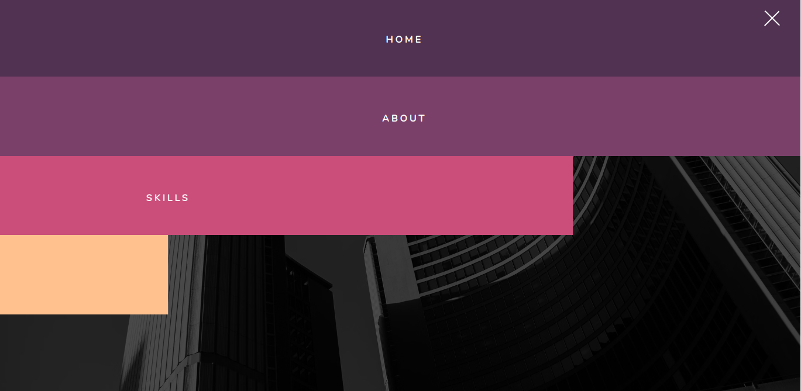

# Navigation Nation

Creating a navigation for a website that will have some advanced CSS animations

Live - https://overdrivemachines.github.io/navigation-nation/

## References

- Using CSS Variables - https://developer.mozilla.org/en-US/docs/Web/CSS/Using_CSS_custom_properties
- Color Selector
  - https://paletton.com/
  - https://colorhunt.co/
- Menu Icon
  - W3 Schools - https://www.w3schools.com/howto/howto_css_menu_icon.asp
  - Me on Codepen - https://codepen.io/overdrivemachines/pen/abYxwmK
